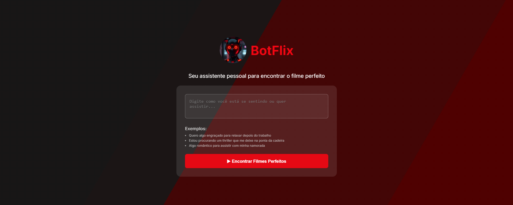

# 🤖 Projeto Botflix

## 🔍 Sobre o Projeto
Projeto desenvolvido durante o evento online Imersão DEV do Futuro, promovido pelo canal Dev em Dobro.
O objetivo foi aprofundar os estudos em programação, com foco em integração de IA, consumo de APIs e automação com N8N.

O Botflix é um assistente de inteligência artificial projetado para recomendar o filme ideal de acordo com a necessidade do usuário.
A aplicação utiliza um fluxo de automação no N8N, integrado à API The Movie DB, para buscar e retornar sugestões de filmes.

O usuário pode realizar pesquisas por meio de um campo de busca, digitando palavras-chave e pressionando Enter ou clicando em um botão.
O sistema retorna um filme compatível com a busca, exibindo capa, título, descrição e avaliação.

## 🛠️ Tecnologias Utilizadas

  
  
  

